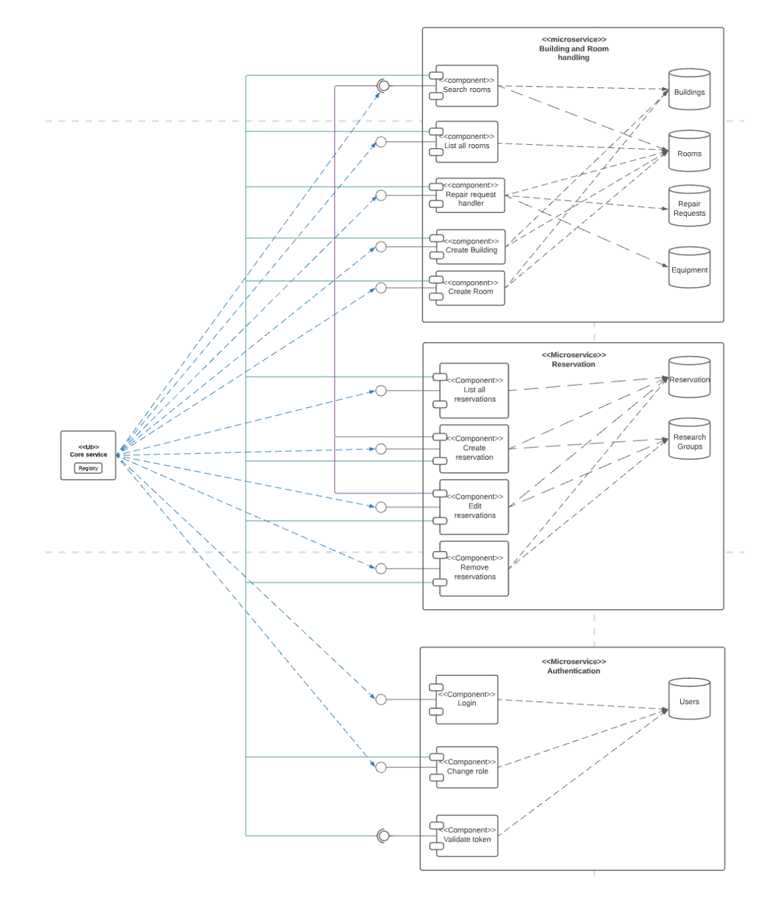
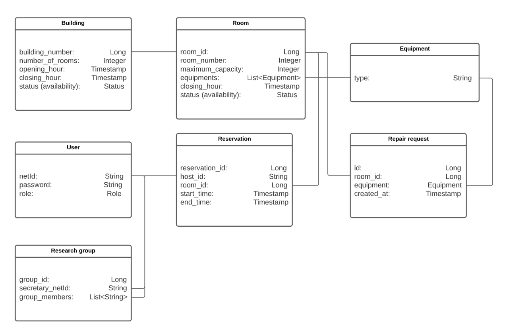

# Room Booking Server
Server implementation serving API requests for room booking, reservation, authentication, and miscellaneous services. The server serves the following domains: buildings, rooms, reservations, users, equipment, repair requests, research groups, and authentication. The micro-schema is designed as shown below.

    

Buildings and rooms, reservations, and users are core domains. Equipment, repair requests, and research groups are supporting domains.

# Building and Room Service
* The ”search rooms” component communicates with the buildings and the rooms databases, giving the user the possibility of searching for a room to make a reservation.
* The ”list all rooms” component communicates with the rooms database and lets the user view all rooms.
* The ”repair request handler” communicates with the rooms database, as well as the repair request and the equipment databases and allows a user to make a request to fix a piece of equipment in a room if they notice that it is broken.
* The ”create building” component adds a new building to the building’s database and updates the room’s database.
* The ”create room” component adds a new room to the rooms database and updates the buildings database.

# Reservation Service
* The ”List all reservations” component communicates with the Reservation database and lets the users see all the reservations they have.
* The ”Create reservation” component communicates with the Reservation and the Research group database to make a new reservation for that user. Furthermore, if the user is a secretary they can make a reservation for all the group members in the research group.
* The ”Edit or Delete reservation” component communicates with both the Reservation and the research group database and allows the user to edit or delete their own reservation.

# Authentication Service 
* The ”Login” component is the first thing a user will do to receive their own token. It will require the user to provide a valid Net-Id and password, which will then be validated by communicating with the user database. Once this process is complete, a valid token will be returned to the user.
* The ”Change role” component allows admins to change roles of specific users, given their Net-Id.
* The ”Validate token” component validates tokens that users provide when making requests to other micro-services

This microservice stands out as the most autonomous among all the other micro-services, as it can accomplish its tasks without relying on data from any other micro-service. Its interaction with other micro-services is limited to receiving data solely for the purpose of validating tokens sent along with their requests. When it comes to role changes or login processes, the authentication micro-service solely relies on user input data and their corresponding requests.

The decision to incorporate tokens and their validation into our application was driven by the need for swift and efficient security implementation. This approach not only provides a faster solution but also offers ease of integration for new components within the system. Consequently, it enables enhanced scalability for our application.

# Database Schema 

    

# Testing and Maintenance 
To measure the quality of the class, we have decided to use CodeMR as our tool for computing code metrics:

1. Lack of cohesion
2. Size
3. Weighted method count
4. Coupling between object classes 5. Number of methods
6. Class line of code

To measure the quality of the methods, we have decided to use Metricstree as our tool for computing code metrics.
1. Condition nesting depth smaller or equal than 3 
2. Lines of code smaller or equal than 80
3. Loop nesting depth smaller or equal than 4
4. Cyclomatic complexity smaller or equal than 10 
5. Number of loops smaller or equal than 6
6. Number of parameters smaller or equal than 2

The provided repository includes unit tests that provide 100% code coverage and mutation tests. 
